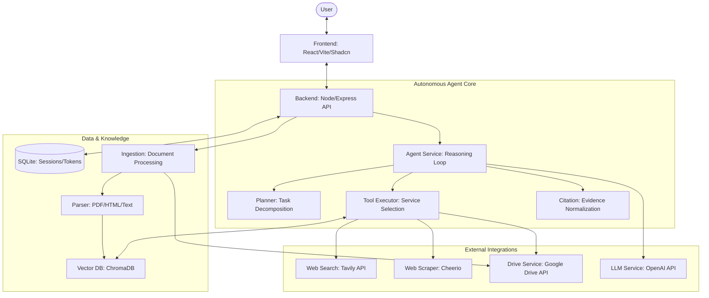

# Agent Search Platform

An autonomous AI search agent that can navigate the web and your private Google Drive documents to answer complex queries with citations.

Built for the **Autonomous AI Agent Assignment**.

## Architecture



## Key Features

- **Autonomous Agent Loop**: Custom-built reasoning loop (Think -> Act -> Observe) without black-box frameworks.
- **Dynamic Planning**: The agent breaks down complex tasks into manageable steps.
- **Multimodal Tooling**:
    - **Web Search**: Powered by Tavily API.
    - **Web Scraper**: Extracts text from any URL.
    - **Vector Search**: Semantic search over your private documents.
    - **Drive Retrieval**: Deep access to Google Drive content.
- **Google Drive Integration**: OAuth 2.0 flow with automated ingestion and incremental indexing.
- **Polished UI**: Modern, dark-mode-first React interface built with Vite, Tailwind CSS, and Shadcn UI.

## Tech Stack

- **Frontend**: React, Vite, Tailwind CSS, Shadcn UI, Framer Motion, Lucide React.
- **Backend**: Node.js, TypeScript, Express.
- **Database**: SQLite (Session/Token storage), ChromaDB (Vector store - Local or Cloud).
- **AI**: OpenAI (GPT-4 Turbo, Text Embeddings).

## Getting Started

### Prerequisites

1.  **Node.js** (v18 or higher).
2.  **ChromaDB**: You can use either a local instance or Chroma Cloud:
    - **Local**: `docker pull chromadb/chroma` and `docker run -p 8000:8000 chromadb/chroma`.
    - **Cloud**: Sign up at [Chroma Cloud](https://www.trychroma.com/).

### Installation

1.  Clone the repository.
2.  Install dependencies for both folders:
    ```bash
    cd backend && npm install
    cd ../frontend && npm install
    ```

3.  Configure Environment Variables:
    Create a `.env` file in the `backend` folder:
    ```env
    PORT=3000
    OPENAI_API_KEY=your_openai_key
    TAVILY_API_KEY=your_tavily_key
    GOOGLE_CLIENT_ID=your_google_client_id
    GOOGLE_CLIENT_SECRET=your_google_client_secret
    GOOGLE_REDIRECT_URI=http://localhost:3001
    CHROMA_URL=http://localhost:8000
    # Optional: Fill these if using Chroma Cloud
    CHROMA_CLOUD_API_KEY=
    CHROMA_CLOUD_TENANT=
    CHROMA_CLOUD_DATABASE=
    ```

### Running the Project

1.  **Start Backend**:
    ```bash
    cd backend
    npm run dev
    ```

2.  **Start Frontend**:
    ```bash
    cd frontend
    npm run dev
    ```

## Usage

1.  Open `http://localhost:3001`.
2.  Click **Connect Google Drive** and authorize.
3.  Select a folder to start indexing (Ingestion).
4.  Once indexed, ask the agent any question in the search bar.
5.  Watch the agent plan and execute steps in real-time.

## Screenshots

Add screenshots to illustrate the UI and agent flow. Save images under `frontend/public/screenshots/` and reference them below. Example image names: `connect-drive.png`, `indexing.png`, `agent-run.png`.

- Connect Google Drive:

    

- Indexing / Ingestion view:

    

- Agent running and results with sources:

    

If you prefer local paths or a different folder, update the image links accordingly. Screenshots are optional but helpful for demos and documentation.